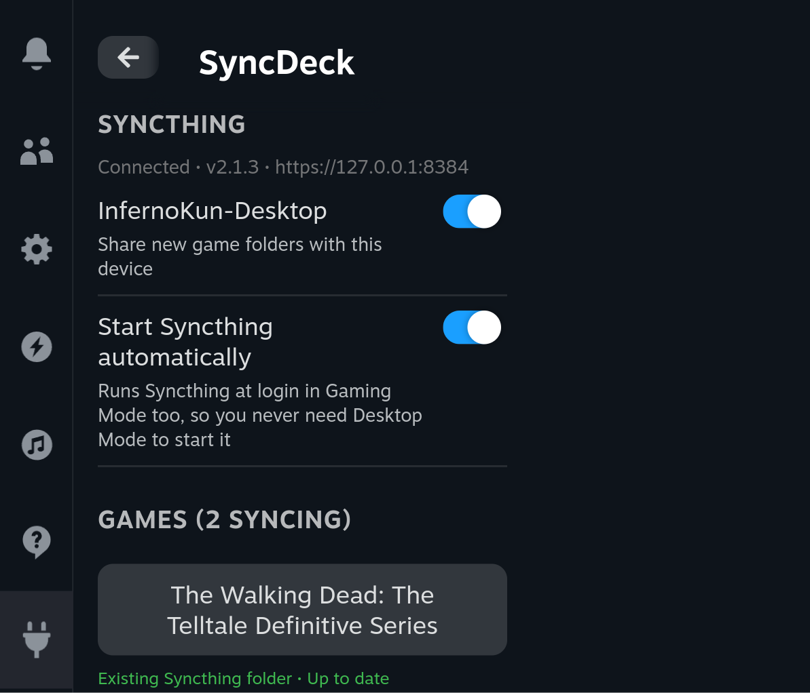

# SyncDeck

[](https://github.com/infernokun/SyncDeck/actions/workflows/ci.yml)
[](https://github.com/infernokun/SyncDeck/releases/latest)
[](https://github.com/SteamDeckHomebrew/decky-loader)
[](LICENSE)

Sync Steam Deck game saves to your PC with Syncthing, from the Quick Access
Menu. SyncDeck finds each game's save folder, registers it with the
Syncthing daemon already running on the Deck, and shows what is syncing.
No per-game setup in the Syncthing web UI.

Built for games that do not have Steam Cloud. Games that do are hidden by
default, since Steam already syncs them.



## Features

- Lists installed Steam games from the `appmanifest` files, across all
  libraries including SD cards.
- Finds the save folder (Proton prefix `Saved Games`, `Documents/My Games`,
  publisher folders under `AppData`, XDG dirs, `save/` inside the install
  dir) and shows the best match inline. You confirm before anything is
  created.
- Creates the Syncthing folder, shares it with your paired devices, turns on
  trashcan versioning.
- Per-game status: up to date, syncing, scanning, waiting for the other
  device to accept, paused by Syncthing, errors.
- Adopts Syncthing folders you made by hand and shows them as synced. Never
  deletes those.
- Starts Syncthing from Gaming Mode. Can install a user systemd unit so it
  starts at login without a trip to Desktop Mode.
- Knows which drive a game's saves are on. Tells you when an SD card is out,
  offers to relocate a folder when saves moved, lets you forget games that
  are gone.

## Requirements

- Steam Deck with [Decky Loader](https://github.com/SteamDeckHomebrew/decky-loader).
- Syncthing on the Deck. The [SyncThingy](https://flathub.org/apps/com.github.zocker_160.SyncThingy)
  Flatpak from Discover is the usual choice. A native install works too.
- Syncthing on your PC, already paired with the Deck.

## How to

### 1. Install

1. Download `SyncDeck.zip` from the [latest release](https://github.com/infernokun/SyncDeck/releases/latest)
   and copy it to the Deck (Desktop Mode, or `scp` to `~/Downloads`).
2. In Gaming Mode open the Quick Access Menu (`...` button), go to Decky,
   then the gear icon, then Developer.
3. Choose Install Plugin from ZIP and pick the file.

SyncDeck appears in the Decky list. If it does not after a reinstall, see
Troubleshooting.

### 2. First run

1. Open SyncDeck from the Decky list. The Syncthing section shows whether
   the daemon is reachable and which devices are paired.
2. If Syncthing is not running, press Start Syncthing.
3. Turn on Start Syncthing automatically. This writes a user systemd unit
   so Syncthing is up at login, in Gaming Mode too. Without this, a Flatpak
   Syncthing only runs while you are in Desktop Mode.
4. Under the paired devices, leave the toggles on for the machines that
   should receive new folders.

### 3. Add a game

1. In the Games list, each game without a sync shows either a detected
   save folder, "not played on this Deck yet", or "no save folder found".
2. Press the game. The picker opens with the detected folders ranked; the
   best one is preselected. You can type a path instead.
3. Press Sync this folder.
4. On your PC, Syncthing shows a notice that the Deck wants to share a
   folder. Accept it and choose where it goes. Until then the game shows
   "Waiting for <PC> to accept". For a game that is also installed on the
   PC, point it at the game's own save folder there.

While a folder is waiting, the row shows the matching Windows path
(`~\Documents\...`), so you can type it into the PC's dialog without
hunting for it.

### 3b. Let SyncDeck add folders on the PC (optional)

With this set up there is nothing to accept: SyncDeck creates the folder on
the PC itself, in the right place, when you pick a game on the Deck.

- Saves in the Proton prefix go to the same place in your Windows profile,
  for example `~\Documents\Eidos\Tomb Raider - Underworld`. If that
  folder already exists on the PC (the game is installed there), the two
  sides merge.
- Saves inside the game's install folder: SyncDeck looks for the game in
  the PC's Steam libraries (`Program Files (x86)\Steam`, `SteamLibrary`,
  `Steam`, `Games\Steam` on each drive) and uses the real install path.
- Anything without a Windows equivalent (Linux-native games) goes under
  `~\SyncDeck\<Game>` as a backup.

A toast on the Deck tells you where the folder landed.

1. On the PC, open Syncthing, then Actions, Settings, GUI.
2. Set GUI Listen Address to `0.0.0.0:8384` and save. Allow it through the
   Windows firewall if asked.
3. Copy the API key from the same page.
4. On the Deck, in SyncDeck's Syncthing section, press PC Syncthing: set up
   auto-add. The address is filled in already, taken from the device you
   are syncing with. Put in the key and save.

**Getting the key across without typing it.** A 32 character key on the
on-screen keyboard is miserable, so you do not have to. On the PC, save the
key to a file and put it in a folder the Deck already syncs. It arrives on
the Deck by itself; press _Import key from ..._ in the same dialog and it is
read and the file deleted. Your home folder or `~/Downloads`
work too.

The file can be called `syncdeck-key.txt`, `syncdeck-key`, `.syncdeck-key`,
`.syncthing-key` or `.syncthing`. A file that does not actually contain a key
is left alone.

The file can be just the key on its own line, or include the address:

```
https://192.168.1.20:8384
your-api-key-here
```

Because a synced file exists on both machines, delete it on the PC too once
it has been imported.

The key is stored in SyncDeck's settings file on the Deck (owner-readable
only) and sent to the PC over your LAN. Syncthing's GUI certificate is self
signed, so it is not verified. Paths are mapped for Windows PCs; on a Linux
or Mac PC the folder is still shared and you accept it by hand.

Alternatively, without any of this, Auto Accept on the PC (edit the Deck
device there) adds shared folders under Syncthing's default folder path.

### 4. Day to day

- The list shows live status for synced games while the panel is open.
- Press a synced game to stop syncing it (confirmed first; no files are
  deleted). Y opens the picker to change the path.
- Turn on Show Steam Cloud games to see the hidden ones.
- Games whose SD card is out, or that were uninstalled, move to a Not
  available section with the reason. They can be forgotten there, or
  relocated if the saves turned up somewhere else.

## Troubleshooting

- Logs: `~/homebrew/logs/SyncDeck/`. Every failed action is written there
  with the reason.
- SyncDeck missing from the Decky list after a reinstall: Decky's frontend
  gave up importing it during the reload. Restart Steam, or run
  `scripts/decky-console.mjs` from a PC to force the import and read the
  console.
- "Syncthing is not running" every time you come back from Desktop Mode:
  the Flatpak's tray app started it inside the desktop session, which ends
  when you leave. Turn on Start Syncthing automatically.
- "Waiting for ... to accept the folder": the PC has not approved the
  shared folder yet. Open Syncthing there.
- "Paused by Syncthing: folder path missing": the save folder's drive is
  out or the folder was deleted. Nothing is removed on the other side.
- Game not detected at all: only fully installed Steam games are listed.
  Non-Steam shortcuts are not supported yet.

## Security

What the plugin can and cannot do, since it handles API keys and touches
your save files.

- **No root.** `plugin.json` has no `_root` flag, so it runs as the `deck`
  user, the same user that owns your Steam files and Syncthing's config.
- **It never deletes save files.** Removing a game from SyncDeck deletes the
  _folder entry_ in Syncthing, not its contents. Every folder it creates has
  30-day trashcan versioning, so files deleted by a sync are recoverable on
  both ends.
- **Local Syncthing API key** is read from `config.xml` (owner-readable,
  already yours) and only ever sent to `127.0.0.1`. It is never returned to
  the UI or written to the log.
- **PC Syncthing API key**, if you set one up, is stored in the plugin's
  settings file with `0600` permissions and sent to the address you entered.
  It is masked in the UI and never logged.
- **TLS to your PC is not verified.** Syncthing's GUI certificate is
  self-signed, so there is nothing to verify it against. Someone able to
  intercept traffic on your LAN could capture that API key, which would let
  them read and change your PC's Syncthing config. This is the same exposure
  as using Syncthing's web UI over the LAN. Only enable the PC option on a
  network you trust, and skip it on public Wi-Fi.
- **Folders that hold credentials are refused** as save paths (`~/.ssh`,
  `~/.gnupg`, and Decky's own directory, which contains this plugin's
  settings file). So are the home directory and Steam library roots.
- **Outbound connections** go only to `127.0.0.1` and, if configured, the PC
  address you entered. Syncthing itself handles the actual syncing and its
  own connections.

## Development

Backend is plain Python with no third-party packages. Decky runs plugins in
its own frozen Python, so only the stdlib modules Decky bundles exist;
`main.py` checks the ones this plugin needs at startup.

```
python3 -m unittest discover -s tests -v   # no Steam or Syncthing needed
./scripts/syncdeck-cli.py status           # on a Deck: drive the backend directly
./scripts/syncdeck-cli.py games
./scripts/syncdeck-cli.py suggest 620
```

Frontend:

```
npm install
npm run typecheck
npm run build        # dist/index.js
make zip             # out/SyncDeck.zip
```

`make deploy DECK_HOST=deck@<ip>` copies the plugin over SSH if the plugins
dir is writable by the `deck` user. It is root-owned by default, so the ZIP
route is the safe one.

| Path                   | Contents                                                                           |
| ---------------------- | ---------------------------------------------------------------------------------- |
| `main.py`              | Decky entry point                                                                  |
| `py_modules/syncdeck/` | backend: Steam library, Syncthing client, save detection, settings, daemon control |
| `src/`                 | Quick Access Menu panel (React)                                                    |
| `scripts/`             | CLI for the backend, CEF console tool                                              |
| `tests/`               | offline tests against fixture directories                                          |

## License

BSD-3-Clause. See [LICENSE](LICENSE).
